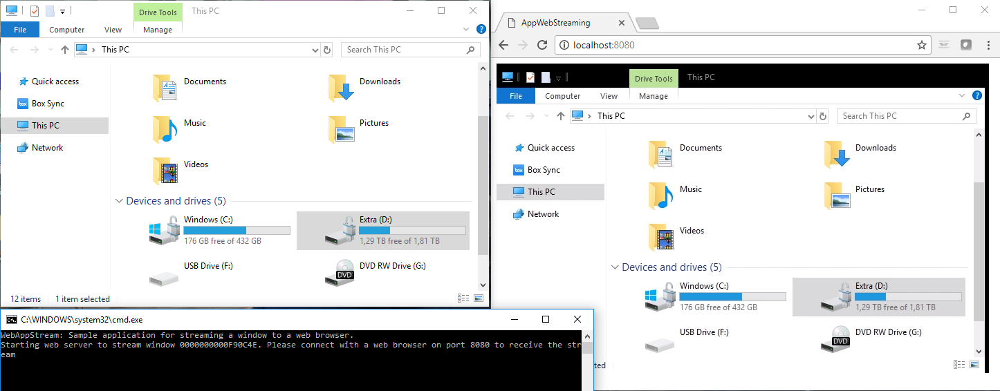

# AppWebStream
[Windows Media Foundation](https://msdn.microsoft.com/en-us/library/ms694197.aspx) and [FFMPEG](http://ffmpeg.org/) sample code for streaming an application window to a web browser. The video is encoded as a H.264 stream inside a fragmented MPEG4 container that is Media Source Extensions (MSE) compatible, so that it can be received by modern web browsers with minimal client-side buffering.

### Getting started

* Open project in VS2015
* Build project
* Start `WebAppStream.exe port [window handle]`. You can use Spy++ (included with Visual Studio) to determine window handles.
* Open `http://localhost:port` in web browser, or on another computer. The stream can also be opened as `http://localhost:port/movie.mp4` in VLC media player.

To build with FFMPG, you first need to download & unzip FFMPEG binaries to a folder pointed to by the `FFMPEG_ROOT` environment variable. Then, set the `ENABLE_FFMPEG` preprocessor define before building.

### Media Foundation issues
* 1 frame latency (1st frame in, no output, 2nd frame in, 1st frame out, ...)
* The MPEG4 container is manually modified as suggested in https://stackoverflow.com/questions/49429954/mfcreatefmpeg4mediasink-does-not-generate-mse-compatible-mp4 to reduce latency and make it Media Source Extensions (MSE) compatible.

The FFMPEG-based encoder is not affected by this issue.

### Browser support
* Confirmed to work with Google Chrome, Microsoft Edge and Firefox.
* Safary doesn't work properly yet. The movie is streamed, but not show on screen. Don't understand why.
