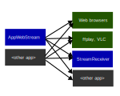

[Windows Media Foundation](https://msdn.microsoft.com/en-us/library/ms694197.aspx) and [FFMPEG](http://ffmpeg.org/) sample code for streaming an application window to a web browser. The video is encoded as a H.264 stream inside a **fragmented MPEG4** container that is [Media Source Extensions (MSE)](https://www.w3.org/TR/media-source/) compatible, so that it can be received by modern web browsers with minimal client-side buffering.

### Scope
This repo contains a _reference implementation_ that demonstrates how MPEG4 transmit and receive _can_ be implemented in a product.

Intended usage:
* Lightweight environment for experimenting with video encoding settings.
* Starting point for developing product implementations.
* Independent implementation for compatibility testing.

### Testing possibilities
The `AppWebStream` and `StreamReceiver` projects in this repo can be used together with web browsers and VLC to test other apps ability to both _transmit_ and _receive_ streamed MPEG4 videos:  

### Getting started

* Open project in Visual Studio
* Build project
* Start `WebAppStream.exe port [window handle]`. You can use Spy++ (included with Visual Studio) to determine window handles.
* Open `http://localhost:port` in web browser.

To build with FFMPG, you first need to download & unzip FFMPEG binaries to a folder pointed to by the `FFMPEG_ROOT` environment variable. Then, set the `ENABLE_FFMPEG` preprocessor define before building.

### AppWebStream implementation details

#### Video metadata
Metadata implementation status:
* [x] Pixel spacing metadata
* [x] All frames time-stamped with <0.1ms temporal accuracy against the MEPG 1904 epoch
* [ ] Video "origin" metadata ([issue #23](../../issues/23))
* [ ] Freeze & resume frame time-stamps might lead to paused web browser playback ([issue #24](../../issues/24))

#### HTTP and authentication
* Authentication is currently missing.
* The handcrafted HTTP communication should be replaced by a HTTP library.

#### Media Foundation details
* **0 frame latency**, except for the first 4 frames (frame N in, frame N out, frame N+1 in, frame N+1 out, frame N+2 in, frame N+2 out, ...)
* The MPEG4 container is manually modified as suggested in https://stackoverflow.com/questions/49429954/mfcreatefmpeg4mediasink-does-not-generate-mse-compatible-mp4 to make it Media Source Extensions (MSE) compatible for streaming. The FFMPEG-based encoder is not affected by this issue.

#### Frame grabbing method
The project is currently using the GDI [`BitBlt`](https://learn.microsoft.com/en-us/windows/win32/api/wingdi/nf-wingdi-bitblt) function to copy the content of the specified window handle to an offscreen `HBITMAP` object. This works fine for many applications, but single window capture doesn't work for apps that use GPU-accelerated drawing of the parent window. It would therefore probably be better to switch to the newer [Desktop Duplication API](https://learn.microsoft.com/en-us/windows/win32/direct3ddxgi/desktop-dup-api) for frame grabbing ([sample](https://github.com/microsoft/Windows-classic-samples/tree/main/Samples/DXGIDesktopDuplication)).

### Client support
The video stream adheres to the MPEG4 standard, so it should be supported by all client SW supporting H.264 encoded MPEG4 streams. The following clients have already been verified to work:
* Google Chrome
* Microsoft Edge
* Firefox
* [VLC media player](https://www.videolan.org/vlc/): Open stream as `http://localhost:port/movie.mp4`
* [ffplay](https://ffmpeg.org/ffplay.html): `ffplay.exe -flags low_delay -i "http://localhost:port/movie.mp4"`
* StreamReceiver project (in this repo)

Unsupported clients:
* Doesn't yet work on iOS, due to incomplete `ManagedMediaSource` support ([issue #25](../../issues/25)).

Metadata tools:
* [MP4Box.js / ISOBMFF Box Structure Viewer](https://gpac.github.io/mp4box.js/test/filereader.html)
* [ExifTool](https://exiftool.org/) can be used for extracting metadata if saving the stream to file.
